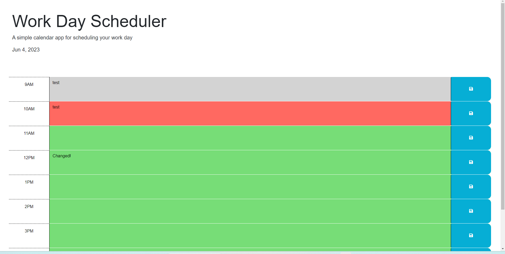

# workday-schedule

Scheduler will keep user input, which will persist after refreshing. If edited, these changes will also perist. Time block styles will change in accordance to the time of day, applying past, present and future CSS classes.

